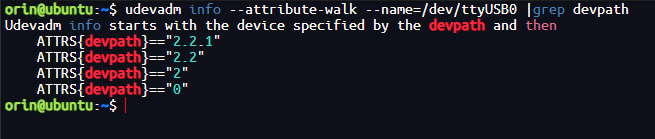

# README.md

If you have any questions or need assistance with usage, feel free to contact Xu Jiang(jx753@sina.com)

### Notice

support motor: GO-M8010-6 motor、A1 motor、 B1 motor

gcc >= 5.4.0 (for x86 platform)

gcc >= 7.5.0 (for Arm platform) 

run gcc --version  command to check your gcc version

### environment

#### 创建一个Python 3.10的虚拟环境

由于Pytorch对于Jetpack6.1系统目前最高支持python3.10，因此选用python3.10。如果无需使用torch，使用其他python3版本均可。

```bash
conda create -n py310 python=3.10
conda activate py310
conda install -c conda-forge libgcc
```

#### 串口模块端口绑定

机器人在使用两个及以上USB串口设备时，设备名与设备之间的对应关系并不是固定的，是按设备接入系统的顺序依次分配的。先插入一个设备再插另一个设备可以确定设备与设备名的关系，但每次系统启动都需要插拔设备，十分麻烦。可以将串口映射到一个固定的设备名上，不论插入顺序如何都会讲设备映射到新的设备名上，我们只要使用新的设备名对设备进行读写操作就可以了。

因为宇树RS485转接器的ID设备号都是一样的，所以需要对其进行设备路径绑定。**不绑定端口可能会导致端口冲突或者识别设备错误（比如ttyUSB0-4顺序乱套），且绑定后的端口不可以随意的更换位置**，否则绑定时无效的。

然后，我们先查看HUB板的端口信息，主要是查看设备路径信息，终端输入

```
udevadm info --attribute-walk --name=/dev/ttyUSB0 |grep devpath
```

得到以下信息，第一行则是说明了该设备的路径信息：



然后，我们修改/etc/udev/rules.d/usb-uart.rules文件，绑定好HUB板的端口号，终端输入

```bash
sudo vim /etc/udev/rules.d/usb-uart.rules
```

在文件中添加以下内容

```
KERNEL=="ttyUSB*",ATTRS{devpath}=="2.2.1",ATTRS{idVendor}=="0403",ATTRS{idProduct}=="6014",MODE:="0777",SYMLINK+="my485serial0"
```

以此类推，绑定其余几个串口设备

说明

```
KERNEL          # 匹配事件的设备名
ATTR{filename}  # 匹配事件设备的sysfs属性。
idVendor        # 生产商编号
idProduct       # 产品号
SYMLINK         # 为/dev/下的设备文件产生符号链接。就是给这个设备取一个别名。
MODE            # 为设备设定权限。
```

#### 赋予当前用户串口权限

```bash
sudo usermod -a -G dialout <用户名>
```

执行完该命令后，需要重启计算机。

执行以下命令，测试用户是否可以正常打开串口

```bash
cat /dev/ttyUSB0
```

若不报错Permission Denied，则说明串口权限正常。

### Build

```bash
mkdir build
cd build
cmake ..
make
```

### Run
If the compilation is successful, many C++ example executable files will be generated in the build folder. Then run the examples
```bash
./example_a1_motor
```

If you need to run the Python example, please enter the "python" folder. Then run the examples with 'sudo', for example:
```python
conda activate py310
python3 example_a1_motor.py
python3 a1_motor_control.py
```

### Change ID
```bash
cd /dev
ls | grep ttyUSB
```
You can see the USB devices. Then connect **only one** motor on this device.

```bash
cd build
sudo ./changeID
```


### Tip

The code snippet below demonstrates an example of assigning values to the command structure `cmd` in `example_a1_motor.cpp`. It should be noted that the commands are all for the **rotor** side. However, the commands we usually compute are for the **output** side. Therefore, when assigning values, we need to consider the conversion between them.

```c++
cmd.motorType = MotorType::A1;
data.motorType = MotorType::A1;
cmd.mode  = queryMotorMode(MotorType::A1,MotorMode::FOC);
cmd.id    = 0;
cmd.kp    = 0.0;
cmd.kd    = 2;
cmd.q     = 0.0;
cmd.dq    = -6.28*queryGearRatio(MotorType::A1);
cmd.tau   = 0.0;
serial.sendRecv(&cmd,&data);
```


Typically, for kp and kd, assuming the motor's gear ratio is r, when calculating kp and kd on the rotor side, we need to convert kp and kd on the output side by dividing them by the square of r. 

$$kp_{\text{rotor}} = \frac{kp_{\text{output}}}{r^2}$$

$$kd_{\text{rotor}} = \frac{kd_{\text{output}}}{r^2}$$

This conversion relationship is demonstrated in the example `example_a1_motor_output.cpp`.By the way, in the example `example_a1_motor_output.cpp`, the kp on the rotor side is additionally divided by 26.07, and the kd on the rotor side is additionally multiplied by 100.0. These are magic numbers for the A1 and B1 motor. When controlling other motors, there is no need to consider these additional steps.
